# Wiki Ingest

Workflow for processing new sources into the wiki. The LLM reads a source, extracts key information, and integrates it into the existing wiki — not just indexing, but synthesizing.

## Core Principle

Ingest is NOT file-and-forget. A single source should touch 5-15 wiki pages: creating new ones, updating existing ones, noting contradictions, strengthening cross-references. Knowledge compounds.

## Source Types

Different source types require different extraction strategies:

| Type | Extract | Example |
|------|---------|---------|
| **Article/Paper** | Concepts, entities, claims, methods | Research papers, blog posts |
| **Spec/Design Doc** | Architecture decisions, component tables, scope boundaries, out-of-scope items | `docs/superpowers/specs/*.md` |
| **Plan** | Tasks, file mappings, validation steps, implementation order | `docs/superpowers/plans/*.md` |
| **Transcript** | Quotes, decisions, action items, open questions | Meeting notes, interview transcripts |

### Spec/Plan Extraction

Specs and plans contain structured information that maps directly to wiki content:

- **Architecture sections** → create/update concept pages for each component
- **Component tables** → create entity pages with properties
- **Scope/out-of-scope** → note in concept pages for future boundary decisions
- **Task checklists** → track as project knowledge (not wiki pages, but link to spec)
- **Directory structures** → capture in entity pages as "file layout"
- **Validation criteria** → file as concept pages for testing/verification

**Cross-reference specs and plans:** Plans reference specs. When ingesting a plan, link back to its spec. When ingesting a spec, note any existing plans that implement it.

## Workflow

```dot
digraph ingest_flow {
    rankdir=LR;
    "Identify source type" -> "Read full source";
    "Read full source" -> "Extract entities/concepts/claims";
    "Extract entities/concepts/claims" -> "Discuss with user";
    "Discuss with user" -> "Create source page";
    "Create source page" -> "Create/update entity/concept pages";
    "Create/update entity/concept pages" -> "Flag contradictions";
    "Flag contradictions" -> "Update index.md";
    "Update index.md" -> "Append log.md";
    "Append log.md" -> "Add back-links";
    "Add back-links" -> "Done";
}
```

### Step 1: Identify Source Type and Read

Determine what kind of source you're ingesting (see Source Types table). Read the full source before creating any pages.

### Step 2: Extract

- **Entities**: People, organizations, products, places, components
- **Concepts**: Ideas, patterns, methodologies, themes, architecture decisions
- **Claims**: Specific assertions that could be contradicted by future sources
- **Connections**: How this relates to existing wiki pages

For specs/plans, also extract:
- **Architecture layers** and their relationships
- **Component inventories** with properties
- **Scope boundaries** (what's in vs. out)
- **Validation criteria** and deployment strategies

### Step 3: Discuss (Optional but Recommended)

Share key takeaways with the user before writing. Get guidance on emphasis, scope, and what matters most. For batch ingest, skip this step.

### Step 4: Write Source Summary

Create `sources/{slug}.md` with:
- Frontmatter (type: source, created date, original filename/URL)
- One-paragraph summary
- Key takeaways as bullet points
- Links to any new or updated wiki pages
- For specs: list of components, architecture decisions, scope notes
- For plans: list of tasks, file mappings, link to parent spec

### Step 5: Update Wiki Pages

For each entity/concept the source touches:
- **New page**: Create it following wiki-schema conventions
- **Existing page**: Add new information, noting the source
- **Contradiction**: If the source contradicts an existing claim, flag it prominently with `> ⚠ Contradicted by [source]: old claim`
- **Reinforcement**: If the source supports an existing claim, note it

### Step 6: Update index.md

Add every new page to the appropriate section of `docs/wiki/index.md` with a one-line summary.

### Step 7: Append log.md

Add an entry: `## [YYYY-MM-DD] ingest | Source Title`

### Step 8: Check Back-Links

For each new or significantly updated page, scan existing pages that should reference it. Add missing cross-references.

## Required Checklist

- [ ] Read full source before creating any pages
- [ ] Identify source type and extract accordingly
- [ ] Create source page at `sources/{slug}.md`
- [ ] Create/update entity pages mentioned in source
- [ ] Create/update concept pages covered by source
- [ ] Flag contradictions with existing content
- [ ] Update `index.md` with new entries
- [ ] Append to `log.md` with parseable prefix
- [ ] Add back-links from new pages to existing pages

## Common Mistakes

- **File-and-forget**: Creating a source summary but not updating any other wiki pages
- **Skipping contradictions**: Not flagging when a new source contradicts existing claims
- **No back-links**: Creating a new concept page but not linking to it from relevant existing pages
- **Index drift**: Forgetting to update index.md, making it stale and useless
- **Missing log entry**: Breaking the chronological timeline
- **Over-writing**: Rewriting entire pages instead of adding new information with source attribution
- **Creating before reading**: Writing new pages before reading existing wiki content to check for duplication
