# Wiki Lint

Periodic health-check for the wiki. Catches issues that accumulate as the wiki grows: contradictions, orphans, stale claims, broken references.

## Core Principle

Wikis decay without maintenance. New sources contradict old claims. Pages get created but never linked to. Summaries become outdated. Linting catches this before it compounds.

## Workflow

```dot
digraph lint_flow {
    rankdir=LR;
    "Scan all pages" -> "Check contradictions";
    "Check contradictions" -> "Check orphans";
    "Check orphans" -> "Check index freshness";
    "Check index freshness" -> "Check log consistency";
    "Check log consistency" -> "Check frontmatter";
    "Check frontmatter" -> "Check dead links";
    "Check dead links" -> "Check spec-plan links";
    "Check spec-plan links" -> "Report findings";
    "Report findings" -> "Fix issues";
    "Fix issues" -> "Done";
}
```



### Step 1: Scan for Contradictions

Read pages looking for claims that conflict with other pages:
- Check `updated` dates — newer pages may have superseded older ones
- Look for explicit contradiction markers (`⚠ Contradicted by...`) and resolve them
- Flag implicit contradictions (same topic, different claims in different pages)

### Step 2: Find Orphan Pages

An orphan page has no inbound links from any other wiki page:
- For each page, check if any other page links to it
- Report orphans — they may need cross-references or deletion
- Exception: `sources/` pages are expected to have fewer inbound links

### Step 3: Check index.md Freshness

- Every wiki page should be listed in `index.md`
- Every entry in `index.md` should correspond to an existing file
- Fix both: missing entries and stale entries

### Step 4: Check log.md Consistency

- Recent ingests should have corresponding new/updated pages
- Verify log entries are parseable (start with `## [YYYY-MM-DD]`)
- Flag gaps — long periods with no entries may indicate neglected work

### Step 5: Validate Frontmatter

Every page must have:
- `title`, `type`, `created`, `updated` fields
- `type` matches the directory (`entities/` → type: entity)
- `updated` is accurate (within the last actual edit)

### Step 6: Check Dead Links

- Scan all wiki pages for markdown links to other wiki pages
- Verify each target file exists
- Report broken links

### Step 7: Check Spec-Plan Cross-References

For project wikis that ingest specs and plans:
- Every plan source page should link to its parent spec (if one exists)
- Every spec source page should list any plans that implement it
- Verify these cross-links exist and point to valid source pages
- Flag plans without spec links (may need investigation)

### Step 8: Report and Fix

Output a summary:
```
Lint Report [YYYY-MM-DD]
- Contradictions found: N (resolved: N, flagged: N)
- Orphan pages: N (linked: N, noted: N)
- Index issues: N (missing: N, stale: N)
- Frontmatter issues: N
- Dead links: N
- Spec-plan link issues: N
Total fixed: N
```

Append the report to `log.md` as: `## [YYYY-MM-DD] lint | Full health check`

## When to Lint

- **Before a major ingest**: Start clean so new sources integrate into a healthy wiki
- **After bulk updates**: Verify nothing broke
- **Periodically**: Every 10-20 ingests, or when the wiki feels "messy"
- **When answers feel wrong**: Contradictions or stale claims may be the cause

## Common Mistakes

- **Only fixing easy issues**: Contradictions are harder to find than dead links — don't skip them
- **Not updating the log**: A lint run without a log entry is invisible to future sessions
- **False orphans**: Some pages are legitimately standalone — note them rather than forcing artificial links
- **Over-fixing**: Don't rewrite pages that are still accurate just because they're old
- **Ignoring spec-plan gaps**: Plans without spec links may indicate missing context or orphaned work
