# Wiki Query

Workflow for searching the wiki, synthesizing answers, and filing good answers back as persistent pages.

## Core Principle

Good answers are wiki pages. A comparison, analysis, or connection you discovered shouldn't disappear into chat history — file it so it compounds in the knowledge base.

## Workflow

```dot
digraph query_flow {
    rankdir=LR;
    "User asks question" -> "Read index.md for relevant pages";
    "Read index.md for relevant pages" -> "Read candidate pages";
    "Read candidate pages" -> "Synthesize answer";
    "Synthesize answer" -> "Worth filing?";
    "Worth filing?" -> "Create query page" [label="yes"];
    "Worth filing?" -> "Respond in chat" [label="no"];
    "Create query page" -> "Update index.md";
    "Update index.md" -> "Update log.md";
    "Update log.md" -> "Link from related pages";
    "Link from related pages" -> "Done";
}
```

### Step 1: Search

Read `index.md` first to find candidate pages. Then read the most relevant pages directly. For large wikis (>50 pages), use grep or a search tool to narrow candidates before reading.

### Step 2: Synthesize

Build an answer from the wiki pages you read. Key rules:
- **Cite sources**: Every claim should reference which wiki page(s) support it
- **Note contradictions**: If pages disagree, say so explicitly
- **Identify gaps**: If the wiki doesn't cover something, flag what's missing
- **Output format**: Match the question — markdown for explanations, tables for comparisons, charts for data

### Step 3: Decide Whether to File

File the answer as a query page when:
- It synthesizes multiple pages into a new insight
- It's a comparison or analysis that would be valuable to revisit
- It connects dots that weren't explicitly connected in the wiki
- The user found the answer particularly useful

Skip filing when:
- It's a simple lookup ("what does page X say about Y?")
- It's a one-off factual answer
- It's too brief to be useful as a standalone page

### Step 4: File (if applicable)

Create `queries/{slug}.md`:
- Frontmatter (type: query, created date, tags)
- The question as the title context
- The synthesized answer with citations to wiki pages
- `## Related` section linking to source wiki pages
- Update `index.md` and `log.md`

### Step 5: Link Back

For each wiki page you cited, check if it should link TO your new query page. Add cross-references where relevant.

## Query Patterns for Engineering Wikis

When the wiki covers project specs, plans, and architecture, common query types include:

| Question Type | Example | Search Strategy |
|---------------|---------|-----------------|
| **Component inventory** | "What components are in the observability stack?" | Read spec source pages, scan component tables |
| **Architecture decisions** | "Why does Prometheus use a Deployment not StatefulSet?" | Read spec and plan source pages for rationale |
| **Scope boundaries** | "Is Promtail in scope?" | Check spec's out-of-scope section |
| **Implementation status** | "Which tasks from the plan are complete?" | Cross-reference plan source with git history |
| **Design consistency** | "Does the plan match the spec?" | Read both source pages, compare component lists |
| **Relationship mapping** | "How does Grafana connect to Loki?" | Read component entity pages, trace datasource links |

## Common Mistakes

- **No citations**: Answering without linking claims to specific wiki pages
- **Not filing good answers**: Valuable syntheses that vanish after the conversation
- **Filing everything**: Simple lookups don't need their own page
- **Missing contradictions**: Not flagging when wiki pages disagree on the answer
- **No back-links**: Filing a query page but not linking to it from the pages it cites
- **Ignoring gaps**: Not noting what the wiki doesn't know, which is itself valuable information
- **Confusing spec vs plan**: Specs define *what*, plans define *how*. Keep answers clear about which document type the information comes from
